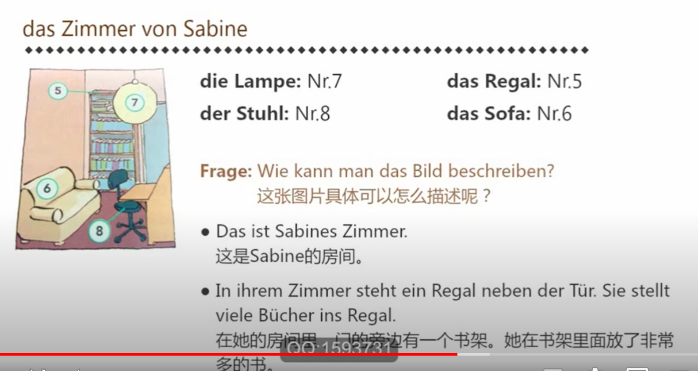
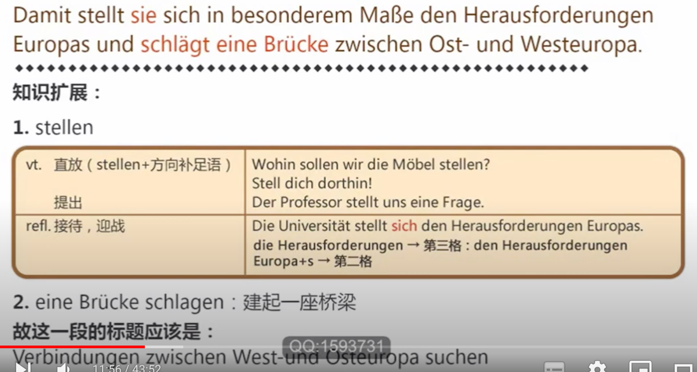

# 1. Frankfurt an der Oder

有两个Frankfurt

die Oder (Fluss) 奥得河
Die Odere ist ein Fluss in Ostdeutschland.

der See, -n 湖	die See 海 
In ND gibt es viele Seen. (Nordsee, Ostsee)

das Herz, -en 心脏
Jeder Mensch hat ein Herz.

der Park, -s 公园
Es gibt viele schöne Parks in Peking.

der Sand (nur Sg.) 沙子
Die Kinder spielen im Sand.

der Strand, Strände 海滩
Sandstrand 海边沙滩

fein 细小的
Der Sand heir ist fein.

klar 清澈的
Der Helene-See hat klares Wasser.
Alles klar! 都明白
Na klar! 我了解了
Das ist mir klipp und klar. 这件事我一清二楚

die Brücke, -n 桥梁
Zwischen Frankfurt und Slubice geht die Brücke **über** die Oder. 
Der Sport schlägt Brücken zwischen den Völkern.

der Backstein (nur Sg.) 砖
Das Rathaus ist **aus** Backstein. 

das Wahrzeichen, - 标志
Das Rathaus ist das Wahrzeichen **der Stadt**. (G.)

die Hansestadt, -städte
Frankfurt an der Odeer war früher eine ~.

die Handelsstadt, -städte
Frankfurt ist eine ~.

der Stadtrat, -räte 市议会

regieren 管理

die Regierung, -en 政府，掌管
Wir unterstützen die Regierung.

das Hochhaus, -häuser 高楼
In Frankfurt am Main gibt es viele Hochhäuser.

das Einkaufszentrum, -zentren 购物中心
Im Einkaufszentrum gibt es viele Geschäfte.

Jung und Alt 老老少少
junge und alte Leute

die Erklärung, -en 解释说明
Die Kursleiterin gibt viele Erklärungen.
• die Erklärung geben 给出解释
erklären vt. 解释
Die Lehrerin erklärt **den Schülern** den Text.

rekonstruieren vt 复述
Rekonstruieren Sie die Erklärung.

Polnisch 波兰语
Viele deutsche Verkäufer lernen Polnisch.

die Freundschaft, -en 友谊

der Beitrag, Beiträge 贡献，文章
Das ist ein Beitrag **zur** Freundschaft zwischen Polen und Deutschland.
Ich schreibe einen Beitrag **für** eine Zeitschrift.

die Währung, -en 货币
Polen und Deutsche können mit ihrer Währung bezahlen.

das Mitglied, -er 成员
Wie viele Mitglieder hat Ihre Familie?

零冠词后形容词词尾：

1. An der Europa-Universität kann
man studieren.
2. Im Freizeit- und Campingpark
Helene-See kann man Camping
machen.
3. Im Oder-Turm gibt es viele
Geschäfte. Dort kann man
einkaufen.
4. Das Rathaus in Frankfurt kann
man besichtigen.

# 2. Die Wohnung von Sabine und Magda

die Einrichtung 布置装饰
	eingerichtet sein
Sabines Einrichtung gefällt mir sehr.
Sabines Zimmer ist gut eingerichtet.

der Gegenstand, -stände 东西，物品
	der Einrichtungsgegenstand, stände 用于布置的物品
Auf dieser Zeichnung sehen Sie viele Einrichtungsgegenstände.

das Gerät, -e 器具
Welche Geräte brauchen Sie unbedingt?

das Möbel, - 家具
Wir brauchen neue Möbel für unsere Wohnung. 

家里的物品分类：**Gegenstand** / **Gerät** / **Möbel**

der Herd, -e 炉灶

die Spüle, -n 水槽

der Kochtopf, -töpfe 锅
Ohne Kochtöpfe kann ich nicht kochen.

die Spülmaschine,-n 洗碗机
Meine Spülmaschine hilft mir sehr.

der Mülleimer, - 垃圾桶
Mülleimer = der Müll ( 垃圾 ) + der Eimer ( 桶 )

der Kühlschrank, -schränke 冰箱

der Schrank, -schränke 橱柜

der Schreibtisch, -e 写字台

der Stuhl, Stühle 椅子

das Regal, -e 架子

das Bücherregal, -e 书架

die Lampe, -n 灯具

das Sofa, -s 沙发
Im Wohnzimmer von Magda steht ein Sofa.

der Staubsauger, - 吸尘器
m. Staub 尘埃 / saugen v. 吸

der Teppich. -e 地毯

ausruhen vt. 休息
Ohne Bett kann ich nicht ausruhen.
Ich ruhe meine Augen aus.
Ich ruhe mich aus.

das Waschbecken, - 洗手台

die Badewanne, -n 浴缸

der Spiegel, - 镜子

der Trockner, - 烘干机
trocken Adj. 干的

die Waschmaschine,-n 洗衣机
Ohne Waschmaschine möchte ich nicht waschen.

spülen v. 洗（餐具）
Ich habe eine Spülmaschine, aber die Kochtöpfe muss ich selbst spülen.

duschen v. 淋浴
Ich kann auch in meiner Badewanne duschen.

gebraucht Adj. 二手的
Magda und Sabine wollen eine gebrauchte Waschmaschine kaufen.

höchstens adv. 最多
Eine gebrauchte Waschmaschine darf höchstens 100 Euro kosten.

mindestens adv. 至少
Eine neue Spülmaschine kostet mindestens 200 Euro.

aufgehen v. 打开
Die Maschine muss vorn aufgehen.

die Verhandlungsbasis (VB) 起价
Die Verhandlungsbasis ist 350 Euro.

die Haushaltsauflösung, -en 变卖处理家具物品
Wenn jemand eine Haushaltsauflösung macht, können wir vielleicht die Möbel kaufen.

und vieles mehr (u.v.m) 以及其他等等

verkaufe (verk.) 出售
Verk. Waschmaschine, ca. 5 J.

das Sparprogramm, -e 节能程序
Hat diese Waschmaschine auch ein Sparprogramm?
sparen v. 节约

die Kombination, -en 组合

die Anzeige, -n 广告 （报纸）
• die Kleinanzeige, -n 小广告（报纸）
• die Werbung, -en 电视广告

aufgeben v.
Wollen Sie eine Anzeige aufgeben? 交付
Gib deine Hoffnung nicht auf! 放弃

das Anzeigenformular, -e 广告表格
Ich möchte das Anzeigenformular fotokopieren.

der Sperrmüll (nur Sing.) 大型垃圾
Sperrmüll findet man manchmal auf der Straße.
Auch eine Anzeigenzeitung heißt so.

die Art, -en 类型
Bitte wählen Sie eine Anzeigenart aus.

das Zeichen, - 字符
Die Anzeige hat 250 Zeichen.

kostenlos Adj. 免费的
Im „SperrMüll" ist eine private Kleinanzeige kostenlos.

gebührenfrei 免费的（学费）
In vielen Bundesländern kann man gebührenfrei studieren.

das Gesuch, -e 申请
Möchten Sie ein Gesuch aufgeben?

beachten v. 注意
Bitte beachten Sie, dass Sie nur 3 Anzeigen aufgeben können.

je 每个
Sie dürfen 250 Zeichen je Anzeige schreiben.

die Ausgabe, -n 期，份，版
In jeder Ausgabe der Zeitung darf man drei Anzeigen aufgeben.

jeweils 每次
jeweils = jedes Mal

maximal 最大，最多
Eine Anzeige darf jeweils maximal 250 Zeichen haben.

die Email-Adresse, -n 电子邮件
info@passwort-deutsch.de
"-" Bindestrich, "." Punkt

der Buchstabe, -n 字母
Wie viele Buchstaben hat dieses Wort?

das Leerzeichen, - 空格
Zwischen den Wörtern sind Leerzeichen.

das Komma, -s/Kommata 逗号
Vor dem Nebensatz steht ein Komma.

einschließen v. 包括
Buchstaben, Leerzeichen, Kommata etc. sind eingeschlossen.

Frage: Wie kann man das Bild beschreiben?
• Das ist die Küche in der Wohnung von Sabine und Magda.
• Neben der Tür steht ein Kühlschrank.
• Ganz links sind ein Herd und eine Spüle.
• Rechts steht ein Küchentisch. Unter dem Küchentisch ist ein Mülleimer.

Frage: Wie kann man das Bild beschreiben?
• Das ist Sabines Zimmer.
• In ihrem Zimmer steht ein Regal neben der Tür. Sie stellt viele Bücher ins Regal.
• Links steht ein Sofa vor dem Bücherregal.
• Ganz rechts sind ein Schreibtisch und ein Stuhl.
• Und eine Lampe hängt an der Zimmerdecke.

Frage: Wie kann man das Bild beschreiben?
• Das ist das Bad in der Wohnung von Sabine und Magda.
• Ein Waschbecken ist hinten neben der Tür.
• Über dem Waschbecken hängt ein Spiegel an der Wand.
• Es gibt auch eine Badewanne. Hier können Sabine und Magda duschen.

Frage: Wie kann man das Bild beschreiben?
• Das ist das Zimmer von Magda. Hinten links liegt ein Bett.
• Rechts an der Wand steht ein großer Schrank.
• In der Mitte liegt ein Teppich auf dem Boden.
• Auf dem Teppich gibt es einen Staubsauger.
• Links neben dem Teppich sind ein Schreibtisch und ein Stuhl.

1. Sabine braucht noch ein Bett.
2. Sabine braucht noch einen Schrank.
3. Magda braucht noch eine Lampe.
4. Magda braucht noch ein Bücherregal.
5. Sabine und Magda brauchen noch einen Fernseher.
6. Sabine und Magda brauchen noch Kochtöpfe.

1. bei Eltern
  • Heimatstadt 家乡（靠近学校）
  • billig und bequem 
2. Ein Zimmer im
  Studentenwohnheim
  • die billigste Form 最便宜的方式
  • schwer zu bekommen 很难申请
  • lange warten 长时间等待
3. Ein Zimmer in einer Wohngemeinschaft (WG)
  Das heißt: Mehrere Studenten mieten eine große Wohnung. Jeder Student bekommt ein Zimmer. Küche und Bad benutzen alle.
  • günstig 实惠
  • Kontakt zu Mitbewohnern 和同学有更多的交流
  • Rücksicht auf die anderen nehmen 要照顾其他同学

4. Ein Zimmer zur Untermiete
  Das bedeutet: Ein Student mietet ein Zimmer in einer Wohnung. In dieser Wohnung wohnt auch der Vermieter. Der Student kann Küche und Bad benutzen.
  • teurer als ein Zimmer im Studentenwohnheim 
  • manchmal Probleme mit dem Vermieter 有时和房东闹矛盾
5. eine eigene Wohnung
  • sehr teuer 
  • einsam

  

# 3. Die Europa-Universität

## Wort - 1

die Herausforderung, -en 挑战
Das Studium in Deutschland ist eine Herausforderung für mich.
• Herausforderung **für**....: 对...的挑战

das Maß (nur Sing.) 程度
In gewissem **Maße** hat er recht. （语言习惯加e）

Jura (Studienfach) 法律
An der Universität kann man Jura studieren.
• studieren: 大学
• Iernen : 中小学

die Wissenschaft, -en 科学
• Wirtschaftswissenschaften 经济学

fördern v. 促进
• die Freundschaft fördern : 促进友谊
• den Appetit fördern : 促进胃口

die Verständigung (nur Sing.) 互相理解
z.B. Diese Universität fördert die Verständigung zwischen Ost- und Westeuropa.

durchlässig Adj. 可通过的
Die Grenzen in Europa sind durchlässiger geworden.

## Text - 1 Die Viadrina in Frankfurt(Oder)

### Verbindungen zwischen West-und Osteuropa suchen

Die Universität Viadrina in Frankfurt an der Oder hat eine lange Geschichte.
die Geschichte 历史，故事
• Geschichte haben : 有...的历史
China hat eine lange Geschichte.
• Das ist doch eine spannende Geschichte.

Seit 1991 ist sie Europa-Universität.
sie = Die Universität Viadrina 

Damit stellt sie sich in besonderem Maße den Herausforderungen Europas und schlägt eine Brücke zwischen Ost- und Westeuropa.
**eine Brücke schlagen** 建起一座桥梁

---

### internationale Begegnungen fördern

Eine internationale Orientierung und Verständigung zwischen den Völkern und den Kulturen sind Ziele der Europa-Universität.

Schon jetzt ist die Hochschule eine Begegnungsuniversität für junge Menschen aus allen Teilen der Welt geworden.

 

Ihre Studenten und Mitarbeiter studieren und leben in Frankfurt(Oder) und Slubice; sie kommen aus mehr als 40 Ländern und ein Drittel von ihnen sind Polen.

----

### Studienfächer an der Europa-Universität

In den Fakultäten an der Viadrina - Jura, Wirtschaftswissenschaften und Kulturwissenschaften - **nehmen** deshalb europäische und internationale Aspekte von Recht, Wirtschaft und Kultur eine besondere **Rolle ein**.

**Seit** die Grenzen in Europa durchlässiger werden, hat auch das Lernen von Sprachen eine völlig neue **Dimension** erhalten.

Neben Sprachkenntnissen ist Sensibilität für andere Kulturen und Denkweisen gefragt.

## Wort - 2

der Eindruck, Eindrücke 印象，感受
Ich habe guten Eindruck von ihm.

das Gymnasium, Gymnasien 文理中学
• das Abitur :

@ die Realschule 实科
@ die Hauptschule 普通 （5th-9th）
© die Gesamtschule 综合型

empfehlen, empfiehlt (+ D) + A 推荐
Mein Lehrer am Gymnasium hat mir ein Studium an der Viadrina empfohlen.
• an dem Gymnasium = am Gymnasium

interessieren +A 使感兴趣
Die deutsche Kultur interessiert mich.
= Ich interessiere mich für die deutsche Kultur.

inzwischen Adv. 在此期间，现在
Ich muss noch arbeiten und du kannst inzwischen einkaufen gehen.

längst Adv. 早就
Das ist längst bekannt.

beenden v. 结束
Ich habe mein Studium längst beendet.
• das Ende 结束
Mein Studium geht länast zu Ende

die Stelle, -n 职位
Er hat schon eine Stelle bei Siemens bekommen.

begeistert (sein) 振奋高兴的
Ich bin begeistert über das gute Angebot der Uni.
Ich bin begeistert darüber, dass das Angebot der Uni so gut ist.

gratulieren + D 祝贺
Meine Freunde hat mir zum Geburtstag gratuliert.
• zu + 目的

unbedingt Adv. - 一定
Ich wollte unbedingt in Deutschland studieren.

der Schwerpunkt, -e 重点
Die Uni legt den Schwerpunkt auf die Verbindung zwischen Ost und West.
• den Schwerpunkt auf ... legen 把重点放在...上

wenn Konj. 当...时
Die Sprache hilft uns, wenn wir in Deutschland Urlaub machen.
Wenn wir in Deutschland Urlaub machen, hilft uns die Sprache.

die Wahl （Sing.）选择，选举
Wer die Wahl hat, hat die Qual.

überfüllt 过分拥挤的
Die westdeutschen Unis sind immer so überfüllt.

allerdings Adv. 可是
Allerdings fehlt mir in Frankfurt auch etwas.

die Atmosphäre,-n 气氛
Das ist die Großstadtatmosphäre.

recht Adj. (=ziemlich) 很
Die Stadt ist doch recht klein.

die Kenntnisse (PI.) 知识
Die Sprachkenntnisse helfen uns bei der Jobsuche.
• helfen + D +bei + D: 在某方面帮助某人

das Gericht, -e 菜
das Nationalgericht,-e 国菜
Pekingente ist ein Nationalgericht. Es schmeckt sehr gut.

der Kursort, e 学习班所在地
Was gefällt Ihnen an Ihrem Kursort?
• gefallen +D : 物主

## Verben mit Dativ-Objekt

gefallen + D 使喜欢
Gefällt **deiner Freundin** das Bild?

fehlen + D 使缺少
Die Großstadtatmosphäre fehlt **mir** in Frankfurt (Oder).

schmecken + D 有滋味
Das Essen schmeckt **meinen Eltern** gut.

gratulieren + jmdm. (D) 祝贺
Wir gratulieren ihm zum neuen Jahr.

glauben + jmdm. (D) 认为，相信
Ich glaube dir kein Wort.

erzählen + jmdm. (D) von etw. (D) 叙述
Kannst du mir etwas von Peter erzählen?

helfen + jmdm. (D) 帮助
Die Lehrerin hilft den Schülern.

# 4. Verben mit Dativ Objekt

## Text - 2 Eindrücke von Studenten und Mitarbeitern der Europa-Universität

### Fritz N., Unimitarbeiter

Mein Lehrer am Gymnasium hat mir ein Studium an der Viadrina empfohlen, weil mich die polnische Kultur interessiert hat.

Er hat mir damals von dieser neuen Europa-Universität erzählt. Inzwischen habe ich mein Studium längst beendet und habe eine Stelle an der Uni.

---

### Suse P., Studentin aus Dessau

Ich habe ein Stipendium für die Viadrina und bin ganz begeistert darüber. Auch meine Freunde haben mir gratuliert, weil ich dieses Stipendium bekommen habe. Ich wollte nämlich unbedingt ein
Studium mit europäischem Schwerpunkt anfangen.

---

### Suzanne L. und Michel S., Studentenpärchen aus Frankreich

Wir können jetzt sogar schon ein bisschen Polnisch.
Das hilft uns, wenn wir in Slubice einkaufen gehen.
Die Eltern von Michel haben uns auch schon hier besucht, ..

... und da haben wir Bigos, eine polnische Spezialität, für sie gekocht. Das hat ihnen sehr gut geschmeckt.

---

### Tomek und Robert, Studenten aus Polen

Unsere Verwandten in Polen wollten uns nicht **glauben**, dass wir wirklich in Deutschland studieren wollten. Wir studieren jetzt schon zwei Semester hier und sind sehr **zufrieden mit** unserer Wahl.

---

### Dorothee J., Professorin

Mir gefällt es, dass die Uni nicht so überfüllt ist wie viele westdeutsche Universitäten. Zum Beispiel habe ich hier mehr Zeit für die Studienberatung. Allerdings fehlt mir in Frankfurt die Großstadtatmosphäre, die Stadt ist doch recht klein.

## Verben mit Dativ-Objekt

只加三格宾语

Ich helfe dir. 
Maria gratuliert ihrer Schwester. 
Der neue 007-Film gefällt ihm.

**人三物四，先三后四，代词前置**

Der Lehrer empfiehlt dem Unimitarbeiter die Viadrina.
Der Sekretärin gebe ich das Päckchen.
Das Päckchen gebe ich der Sekretärin.

Sie erzählt ihm eine Geschichte.
Bring mir bitte das Buch.
Ich gebe es der Sekretärin. (das Päckchen) 
Der Lehrer empfiehlt sie dem Unimitarbeiter. (die Viadrina)

Hat er es dir schon gesagt?
Ich gebe es ihr.
Felix kann den Brief nicht lesen. Kannst du ihn
ihm übersetzen?

